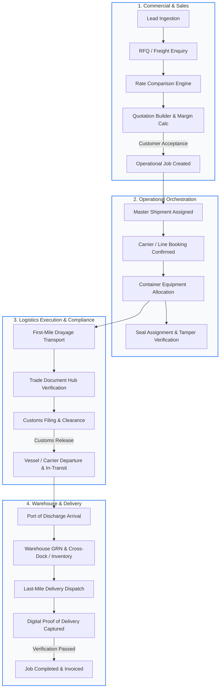
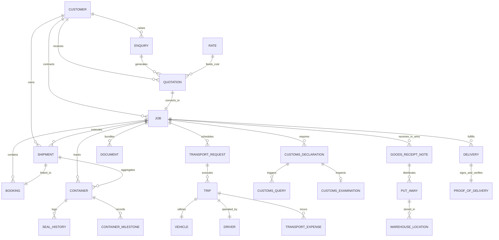

# FLOQ - Connect. Centralize. Flow.
### The Unified Single Source of Truth (SSOT) Architecture & Operations Manual

[](https://nextjs.org/)
[](https://react.dev/)
[](https://www.typescriptlang.org/)
[](https://tailwindcss.com/)
[](https://zustand-demo.pmnd.rs/)
[](https://www.radix-ui.com/)
[](#)

---

## 📌 Executive Summary

**FLOQ** is an enterprise-grade, cloud-native **Logistics Management System & Supply Chain Platform**. It unifies multimodal freight forwarding (Ocean, Air, Road, Rail), drayage transport, carrier bookings, physical container & seal integrity tracking, statutory customs clearance, multi-zone warehouse 3PL fulfillment, document compliance, and operational financial intelligence into a cohesive, high-performance platform.

Historically, freight forwarders and 3PL providers operated across isolated spreadsheets, disparate carrier portals, disconnected trucking dispatch boards, paper customs folders, and detached accounting ledgers. **FLOQ eliminates operational fragmentation** by instituting a centralized reactive state machine where commercial agreements directly generate operational execution jobs, triggering synchronized workflows across customs brokers, drayage carriers, terminal operators, and consignees.

---

## 📑 Table of Contents

1. [High-Level System Architecture](#1-high-level-system-architecture)
2. [End-to-End Operational Lifecycle & Data Flow](#2-end-to-end-operational-lifecycle--data-flow)
3. [Domain Entity Relationship Model (ERD)](#3-domain-entity-relationship-model-erd)
4. [Functional Modules Breakdown](#4-functional-modules-breakdown)
   - [4.1 Global Command Dashboard](#41-global-command-dashboard)
   - [4.2 CRM & Commercial Sales](#42-crm--commercial-sales)
   - [4.3 Rate Engine & Quotation Builder](#43-rate-engine--quotation-builder)
   - [4.4 Operational Jobs Command Center](#44-operational-jobs-command-center)
   - [4.5 Freight Shipments & Carrier Bookings](#45-freight-shipments--carrier-bookings)
   - [4.6 Container & Equipment Lifecycle](#46-container--equipment-lifecycle)
   - [4.7 Road Drayage & Transport Execution](#47-road-drayage--transport-execution)
   - [4.8 Customs Clearance Engine](#48-customs-clearance-engine)
   - [4.9 Delivery Execution & Digital POD](#49-delivery-execution--digital-pod)
   - [4.10 Warehouse Management System (WMS)](#410-warehouse-management-system-wms)
   - [4.11 Trade Document Hub & Compliance Matrix](#411-trade-document-hub--compliance-matrix)
5. [The Golden Reference Consignment (`JOB-2026-00125`)](#5-the-golden-reference-consignment-job-2026-00125)
6. [Security, Authentication & Session Architecture](#6-security-authentication--session-architecture)
7. [State Management & Data Flow Architecture](#7-state-management--data-flow-architecture)
8. [Codebase Directory & Module Map](#8-codebase-directory--module-map)
9. [Technology Stack](#9-technology-stack)
10. [Environment Variables & Configuration](#10-environment-variables--configuration)
11. [Installation & Local Deployment Guide](#11-installation--local-deployment-guide)
12. [Module Development & Extension Guide](#12-module-development--extension-guide)

---

## 1. High-Level System Architecture

FLOQ is constructed using a modern, domain-driven decoupled architecture optimized for sub-millisecond local latency, real-time reactive UI feedback, and enterprise auditability.

```
┌────────────────────────────────────────────────────────────────────────────────────────┐
│                                 PRESENTATION LAYER                                     │
│   Next.js 15 App Router  │  React 19  │  Tailwind CSS v4  │  Radix UI  │  Lucide UI   │
│   Responsive Shell  │  Dark/Light Theme  │  Framer Motion  │  Recharts Visualizations  │
└───────────────────────────────────────────┬────────────────────────────────────────────┘
                                            │
┌───────────────────────────────────────────▼────────────────────────────────────────────┐
│                                CLIENT STATE MACHINE                                    │
│   Zustand 5 Stores (Job, Shipment, Booking, Container, Customs, Transport, Delivery,    │
│                     Warehouse, Document, CRM, Quotation, Rate, Enquiry, App)           │
│   Cross-Store Reactive Synchronization  │  Optimistic Mutations  │  Sonner Feedback    │
└───────────────────────────────────────────┬────────────────────────────────────────────┘
                                            │
┌───────────────────────────────────────────▼────────────────────────────────────────────┐
│                           SERVICES & REPOSITORY LAYER                                  │
│   Base Repository Pattern  │  Type-Safe CRUD Contracts  │  Mock & Live Data Connectors │
│   Zod Schema Validation Engine  │  React Hook Form Resolvers                           │
└───────────────────────────────────────────┬────────────────────────────────────────────┘
                                            │
┌───────────────────────────────────────────▼────────────────────────────────────────────┐
│                           SECURITY & GATEWAY LAYER                                     │
│   Edge Middleware (src/middleware.ts)  │  HMAC-SHA256 Web Crypto Signed Tokens        │
│   HttpOnly SameSite Secure Cookies  │  Next.js Server Actions & REST API Endpoints     │
└────────────────────────────────────────────────────────────────────────────────────────┘
```

---

## 2. End-to-End Operational Lifecycle & Data Flow

Every logistics transaction in FLOQ transitions through a strictly validated sequence of commercial, operational, regulatory, and fulfillment checkpoints:



---

## 3. Domain Entity Relationship Model (ERD)

The structural integrity of FLOQ relies on strict relational keys established across its TypeScript domain interfaces:



---

## 4. Functional Modules Breakdown

### 4.1 Global Command Dashboard
- **Route**: `/` (`src/app/page.tsx`)
- **Key Capabilities**:
  - Live metric aggregations: Active Operational Jobs, In-Transit Trips, Declarations Under Customs Assessment, Pending GRNs, Unverified PODs, and Delivered Consignments.
  - Interactive Recharts visual distribution comparing workload counts across all operational divisions.
  - Real-time **Master Active Operations Table** displaying live jobs, customer entities, modes, origins/destinations, operational statuses, and direct deep links.
  - Quick action launchpad for immediate creation of Jobs, Shipments, Bookings, Declarations, Transport dispatches, and Warehouse GRNs.

### 4.2 CRM & Commercial Sales
- **Routes**:
  - Overview: `/sales/crm`
  - Leads Pipeline: `/sales/leads`
  - Corporate Accounts: `/sales/companies`
  - Contact Persons: `/sales/contacts`
  - Customers Master: `/sales/customers`
  - Customer Enquiries / RFQs: `/sales/enquiries`
  - Commercial Activities: `/sales/activities`
  - Sales Follow-ups: `/sales/tasks`
- **Key Capabilities**:
  - Multi-stage lead qualification pipeline (`New` → `Contacted` → `Qualified` → `Proposal` → `Won` / `Lost`).
  - Company hierarchy linking corporate parents, subsidiaries, and localized operational contact persons.
  - Customer categorization (`VIP Enterprise`, `Key Account`, `Standard`, `Prospect`) with credit ratings, payment terms, and assigned key account managers.
  - RFQ ingestion engine capturing mode, cargo descriptions, weights (KG/MT), volumes (CBM), incoterms (FOB, CIF, DDP, EXW), and delivery deadlines.

### 4.3 Rate Engine & Quotation Builder
- **Routes**:
  - Rate Management: `/sales/rates`
  - Rate Comparison Engine: `/sales/rates/comparison`
  - Quotation Hub: `/sales/quotations`
  - Interactive Quotation Builder: `/sales/quotations/builder`
- **Key Capabilities**:
  - **Vendor Tariff Matrix**: Standardized rates per container, per kg, per CBM, per trip across Ocean Lines (MSC, Maersk, CMA CGM, Hapag-Lloyd), Airlines (Emirates, Qatar Cargo), and Trucking vendors.
  - **Carrier Comparison Matrix**: Side-by-side evaluation of transit times, validity dates, base freights, bunker surcharges, and terminal handling charges (THC).
  - **Quotation Builder**:
    - Itemized cost basket calculations.
    - Real-time margin configuration (percentage vs. fixed spread) with strict internal cost obfuscation.
    - Automated tax calculations (e.g., GST/VAT) and multi-currency pricing (`INR`, `USD`, `EUR`, `AED`, `SGD`).
    - One-click commercial acceptance converting approved quotes directly into active operational jobs.

### 4.4 Operational Jobs Command Center
- **Routes**:
  - Jobs Command Center: `/operations/jobs`
  - Create Operational Job: `/operations/jobs/create`
  - Deep Job Dossier: `/operations/jobs/[id]`
- **Key Capabilities**:
  - The central anchor of the FLOQ platform. Every job acts as a master dossier uniting commercial, operational, regulatory, and financial parameters.
  - Multi-tab command dossier:
    - **Overview**: Summary metrics, route metadata, financials, and live milestones.
    - **Shipments & Bookings**: Integrated view of master line bookings and consignment legs.
    - **Container Inventory**: Assigned equipment, container sizes, tare weights, and seal numbers.
    - **Customs Status**: Live customs progress (filing, duty payment, examination).
    - **Transport & Drayage**: First-mile/last-mile haulage dispatch tickets.
    - **Document Completeness Matrix**: Color-coded verification status of required trade documents.
    - **Task Board & Audit Trail**: Operational checklist items assigned to operators with overdue flags.

### 4.5 Freight Shipments & Carrier Bookings
- **Routes**:
  - Shipments Registry: `/operations/shipments`
  - Shipment Detail: `/operations/shipments/[id]`
  - Create Shipment: `/operations/shipments/create`
  - Carrier Bookings: `/operations/bookings`
  - Booking Detail: `/operations/bookings/[id]`
  - Create Booking: `/operations/bookings/create`
- **Key Capabilities**:
  - Modal support for Ocean (FCL/LCL), Air Freight, Road Freight (FTL/LTL), and Multimodal rail links.
  - Carrier booking confirmation tracking, vessel names, voyage numbers, flight numbers, ETD, ETA, ATD, ATA schedules.
  - Automated shipment milestone management (Registered, Cargo Received, Customs Cleared, Vessel Departed, Transshipment, Discharged, POD).
  - Delay notification engine with operational impact analysis.

### 4.6 Container & Equipment Lifecycle
- **Routes**:
  - Container Yard Management: `/operations/containers`
  - Container Detail: `/operations/containers/[id]`
  - Container Assignment: `/operations/containers/create`
- **Key Capabilities**:
  - Physical container validation (ISO 6346 types: 20FT, 40FT, 40HC, Reefer, Open Top, Flat Rack, ISO Tank).
  - **Seal Security Lifecycle**:
    - Assignment of tamper-evident bolt seals (`SL-XXXXXX`).
    - Audit log of seal replacements (`SealHistory`) documenting historical seals, replacement timestamp, operator, and statutory justification.
  - Gross, tare, and payload weight calculation with overload prevention warnings.
  - Real-time location tracking from empty pickup, depot yard, gate-in, vessel stowage, gate-out, to empty return.

### 4.7 Road Drayage & Transport Execution
- **Routes**:
  - Transport Command: `/operations/transport`
  - Create Transport Request: `/operations/transport/create`
  - Trip Detail: `/operations/transport/[id]`
  - Real-time trip status tracking (`Pending Assignment` → `Assigned` → `In Transit` → `Arrived` → `Completed`).
  - Driver expense auditing: In-route logging of toll charges, fuel expenses, and driver allowances against specific trip IDs.

### 4.8 Customs Clearance Engine
- **Routes**:
  - Customs Clearance Hub: `/operations/customs`
  - Declaration Detail: `/operations/customs/[id]`
  - New Declaration Filing: `/operations/customs/create`
- **Key Capabilities**:
  - Comprehensive management of **Import (Bill of Entry)**, **Export (Shipping Bill)**, and **Transit** declarations.
  - Port of entry/exit integration (e.g., JNPT Nhava Sheva, BOM Air Cargo Complex, Jebel Ali Port, Frankfurt Cargo City).
  - Financial assessment calculations: Invoice value, freight value, insurance value, assessable customs value, basic customs duty, IGST/VAT, and statutory surcharge calculations.
  - **Statutory Workflow Modals**:
    - *Filing Modal*: Formal declaration number generation and broker sign-off.
    - *Duty Payment Modal*: Challan generation, payment reference logging, and clearance release.
    - *Query Management Modal*: Tracking queries raised by customs appraisers, priority flags, and formal reply submissions with documentary evidence.
    - *Physical Examination Modal*: Scheduling dock officers, recording inspection observations, and issuing customs examination reports.

### 4.9 Delivery Execution & Digital POD
- **Routes**:
  - Delivery Dispatch: `/operations/delivery`
  - Create Delivery Ticket: `/operations/delivery/create`
  - Delivery Detail: `/operations/delivery/[id]`
  - POD Verification Queue: `/operations/delivery/pod`
- **Key Capabilities**:
  - Appointment scheduling with customer delivery time windows.
  - **Mobile-Responsive Digital POD Capture**:
    - Consignee recipient name, designation, and contact phone.
    - Quantity delivered vs. expected quantity reconciliation.
    - Shortage and cargo damage quantification.
    - In-browser HTML5 touch/stylus signature pad capture.
    - Photographic delivery proof upload.
  - Two-stage POD verification workflow preventing job closure until operational management validates recipient signatures and unloads without exceptions.

### 4.10 Warehouse Management System (WMS)
- **Routes**:
  - Warehouses & Locations: `/warehouse/locations`
  - Inbound GRN (Goods Received Notes): `/warehouse/grn`
  - Stock Inventory: `/warehouse/inventory`
  - Picking Operations: `/warehouse/picking`
  - Packing Workflows: `/warehouse/packing`
  - Outbound Dispatch: `/warehouse/dispatch`
- **Key Capabilities**:
  - Multi-facility management (Bonded warehouses, Distribution Centers, Cold Storage Vaults, Cross-Docks).
  - Hierarchical location taxonomy: `Warehouse` → `Zone` → `Aisle` → `Rack` → `Shelf` → `Bin`.
  - Inbound GRN generation with physical tallying and automated discrepancy flagging.
  - Put-away rule assignment to optimize space utilization.
  - Pick-list generation, packing inspection checklists, and outbound dispatch staging.

### 4.11 Trade Document Hub & Compliance Matrix
- **Routes**:
  - Document Center: `/documents/center`
  - Verification Queue: `/documents/verification`
  - Requirements Matrix: `/documents/requirements`
  - Standard Document Templates: `/documents/templates`
- **Key Capabilities**:
  - Categorized document indexing: Commercial Invoices, Bills of Lading (B/L), Air Waybills (AWB), Packing Lists, Certificates of Origin (COO), Shipping Bills, Dangerous Goods Declarations, EIRs, and PODs.
  - **Automated Trade Requirements Engine**: Rule matrix mapping mandatory document sets based on transport mode, cargo classification, and destination port.
  - Document Completeness Widget (`src/components/documents/document-completeness-widget.tsx`): Instantly informs operators of missing documents prior to vessel sailing or customs submission.
  - In-browser PDF & image preview modal with metadata inspection, document replacement, and tamper verification badges.

---

## 5. The Golden Reference Consignment (`JOB-2026-00125`)

To test, demonstrate, and verify the entire end-to-end integration of FLOQ, the platform incorporates a curated, multi-stage golden dataset located at `src/data/mock/golden-data.ts`.

### Anchor Consignment Profile
| Parameter | Value |
| :--- | :--- |
| **Operational Job ID** | `JOB-2026-00125` |
| **Customer** | **ABC Electronics Ltd** (`CUST-001`), VIP Enterprise |
| **Commercial Origin** | Quotation `QT-00125` accepted from Enquiry `ENQ-00125` |
| **Master Shipment** | `SHP-00125` (Sea Freight Export FCL) |
| **Ocean Line & Booking** | **MSC (Mediterranean Shipping Co)** — Booking `#BKG-00125` |
| **Vessel & Voyage** | **MSC VIRTUOSA** (Voyage `2608W`) |
| **Assigned Equipment** | Container `MSCU1234567` (40ft High Cube, Tare: 3,900 kg, Cargo: 20,600 kg) |
| **Seal Number** | `SL-998822` (High Security Bolt Seal) |
| **Route Corridor** | Nhava Sheva (JNPT), Mumbai, India ➔ Jebel Ali Port, Dubai, UAE |
| **Customs Clearance** | JNPT Customs Port (`CUS-2026-00125`), Shipping Bill Cleared |
| **Financial Health** | Revenue: **₹1,30,000** \| Actual Cost: **₹1,13,000** \| Net Margin: **13.07% (₹17,000)** |
| **Assigned Lead** | Dakhani Usman (Operations Manager, Global Freight Forwarding) |

Operators can navigate to `/operations/jobs/JOB-2026-00125` to witness a live demonstration of all sub-modules connected to a single operational entity.

---

## 6. Security, Authentication & Session Architecture

FLOQ incorporates an enterprise authentication gatekeeper built natively with modern web cryptography and Next.js edge capabilities:

```
[ HTTP Request ]
       │
       ▼
┌────────────────────────────────────────┐
│  src/middleware.ts                     │
│  - Static Asset & Favicon Bypass       │
│  - Public Auth API Bypass              │
└──────┬─────────────────────────────────┘
       │
       ▼
┌────────────────────────────────────────┐
│  verifySessionToken(floq_session)      │
│  - Web Crypto API (SubtleCrypto)       │
│  - HMAC-SHA256 Signature Verification  │
│  - Expiry Check (7-Day TTL)            │
└──────┬─────────────────┬───────────────┘
       │ Valid           │ Invalid / Missing
       ▼                 ▼
[ Allow to Route ]    [ 307 Redirect to /login?redirect=... ]
```

### Key Security Features
1. **Cryptographic Signing**: Tokens are structured as `encodedPayload.encodedSignature` using **HMAC-SHA256** via the native `crypto.subtle` Web Crypto API (`src/lib/auth.ts`). No vulnerable external JWT dependencies required.
2. **HttpOnly Cookie Isolation**: The session cookie (`floq_session`) is flagged `httpOnly`, `sameSite: "lax"`, and dynamically applies `secure: true` in production environments to thwart XSS attacks.
3. **Dual Authentication Gateways**:
   - **Server Action**: `loginAction` (`src/app/login/actions.ts`) provides zero-JS progressive enhancement.
   - **REST API Route**: `POST /api/auth/login` (`src/app/api/auth/login/route.ts`) provides clean programmatic JSON authentication for integrations.

---

## 7. State Management & Data Flow Architecture

State in FLOQ is governed by dedicated **Zustand 5 stores** located in `src/store/`. Each store encapsulates domain data, query methods, mutation handlers, and modal UI states.

### Store Registry
| Store File | Domain Responsibility |
| :--- | :--- |
| `use-app-store.ts` | Theme (Dark/Light), Sidebar collapse, Mobile drawer, Branch/Org switcher, Notifications, Active user profile |
| `use-job-store.ts` | Operational Jobs, timelines, job-specific tasks, and cross-module link aggregations |
| `use-shipment-store.ts` | Freight shipments, transport modes, milestones, delay logs, and activities |
| `use-booking-store.ts` | Carrier bookings, voyage allocations, confirmation dates, and amendments |
| `use-container-store.ts` | Container equipment, ISO codes, seal numbers, seal replacement history, tare/gross weights |
| `use-customs-store.ts` | Customs declarations, duty assessments, query resolution, and physical examination logs |
| `use-transport-store.ts` | Haulage transport requests, trip dispatch, vehicle/driver registries, and driver expenses |
| `use-delivery-store.ts` | Delivery scheduling, out-for-delivery tracking, and digital POD capture & verification |
| `use-warehouse-store.ts` | Facilities, storage zones, rack/bin locations, GRN verification, and pick/pack/dispatch |
| `use-document-store.ts` | Trade documents, verification statuses, requirement matrix checks, and version histories |
| `use-crm-store.ts` | Leads pipeline, company directories, contacts, and customer classification |
| `use-quotation-store.ts` | Quotation builder, cost item baskets, margin calculation, and versioning |
| `use-rate-store.ts` | Carrier and vendor freight tariffs, validity windows, and rate comparison engine |
| `use-enquiry-store.ts` | RFQs, customer service requests, cargo dimensions, and trade corridors |

### Repository Abstraction Layer
Each store interacts through a standard repository pattern (`src/services/`):
- `base.repository.ts`: Generic repository interface defining standard CRUD operations, localized filtering, and error handling.
- Specialized repositories (`customs.repository.ts`, `delivery.repository.ts`, `transport.repository.ts`, `warehouse.repository.ts`, `document.repository.ts`, etc.) contain domain-specific business rules.

---

## 8. Codebase Directory & Module Map

```
logistics-management-system/
├── .env                              # Active environment configuration
├── next.config.ts                    # Next.js configuration
├── package.json                      # Dependency manifest & scripts
├── tsconfig.json                     # Strict TypeScript compiler options
├── public/                           # Static assets, SVG icons, and brand graphics
└── src/
    ├── middleware.ts                 # Edge route protection & auth gatekeeper
    ├── app/                          # Next.js 15 App Router
    │   ├── globals.css               # Design tokens & Tailwind CSS v4 directives
    │   ├── layout.tsx                # Master root layout with UI shell & providers
    │   ├── page.tsx                  # Global Executive Dashboard
    │   ├── not-found.tsx             # Custom interactive 404 & upcoming module page
    │   ├── providers.tsx             # TanStack Query & Sonner Toast wrappers
    │   ├── api/                      # Edge REST API endpoints
    │   │   └── auth/                 # Login & Logout authentication endpoints
    │   ├── login/                    # Authentication UI portal & Server Actions
    │   ├── operations/               # Operational Execution Suite
    │   │   ├── jobs/                 # Jobs command center, creator & [id] dossier
    │   │   ├── shipments/            # Freight shipments registry & [id] detail
    │   │   ├── bookings/             # Carrier bookings & confirmations
    │   │   ├── containers/           # Container yard, seals & [id] tracking
    │   │   ├── transport/            # Road haulage, dispatch & driver trips
    │   │   ├── customs/              # Customs clearance, filing, duties & queries
    │   │   └── delivery/             # Delivery dispatch & digital POD queue
    │   ├── sales/                    # CRM & Commercial Suite
    │   │   ├── crm/                  # CRM dashboard
    │   │   ├── leads/                # Sales leads pipeline
    │   │   ├── companies/            # Corporate accounts directory
    │   │   ├── contacts/             # Stakeholders & customer contacts
    │   │   ├── customers/            # Verified customer accounts
    │   │   ├── enquiries/            # RFQ management & cargo requirements
    │   │   ├── rates/                # Vendor rate cards & comparison engine
    │   │   ├── quotations/           # Quotation hub & interactive builder
    │   │   ├── activities/           # Sales call/meeting logs
    │   │   └── tasks/                # Commercial follow-up tasks
    │   ├── warehouse/                # Warehouse Management Suite
    │   │   ├── locations/            # Facility, zone & rack/bin topology
    │   │   ├── grn/                  # Inbound Goods Received Notes
    │   │   ├── inventory/            # Live stock & SKU counts
    │   │   ├── picking/              # Pick-lists & warehouse fulfillment
    │   │   ├── packing/              # Packing station quality checks
    │   │   └── dispatch/             # Outbound staging & dock dispatch
    │   └── documents/                # Trade Document Hub
    │       ├── center/               # Unified document repository
    │       ├── verification/         # Compliance queue & review
    │       ├── requirements/         # Mandatory document rules matrix
    │       └── templates/            # Standard shipping & customs templates
    ├── components/                   # Reusable UI & Domain Components
    │   ├── layout/                   # AppShell, Collapsible Sidebar, Topbar
    │   ├── ui/                       # 26+ Accessible Radix-powered UI primitives
    │   ├── shared/                   # Global Search modal (Cmd/Ctrl + K)
    │   ├── customs/                  # Filing, Duty, Examination & Query modals
    │   ├── delivery/                 # POD capture, Signature pad & Delivery modals
    │   ├── documents/                # Completeness widget, Upload & Preview modals
    │   ├── transport/                # Haulage assignment, Expense & Delay modals
    │   └── warehouse/                # GRN forms, Put-away, Picking & Dispatch modals
    ├── data/mock/                    # Comprehensive domain mock datasets & golden flows
    ├── hooks/                        # Custom React hooks (e.g., useContainers)
    ├── lib/                          # Core utilities, HMAC auth crypto & validations
    ├── services/                     # Repository interfaces & mock service implementations
    ├── store/                        # 14 Zustand centralized domain stores
    └── types/                        # 14 Domain TypeScript interface definitions
```

---

## 9. Technology Stack

| Layer | Technology | Version | Purpose |
| :--- | :--- | :--- | :--- |
| **Framework** | **Next.js** | `^15.1.7` | App Router, Server Actions, Edge Middleware |
| **UI Library** | **React** | `^19.0.0` | Concurrent mode rendering & modern hooks |
| **Language** | **TypeScript** | `^5.0.0` | End-to-end type safety & strict interface typing |
| **Styling** | **Tailwind CSS** | `^4.0.0` | Utility-first styling & CSS variable theming |
| **UI Primitives** | **Radix UI** | Latest | Unstyled, accessible modal, select, tabs, tooltip |
| **State** | **Zustand** | `^5.0.3` | Lightweight, unopinionated reactive store |
| **Data Querying**| **TanStack Query** | `^5.66.0` | Server-state caching and synchronization |
| **Forms** | **React Hook Form** | `^7.54.2` | High-performance uncontrolled form handling |
| **Validation** | **Zod** | `^3.24.2` | Declarative schema validation for forms & API |
| **Charts** | **Recharts** | `^2.15.1` | Declarative SVG charting for operational KPIs |
| **Icons** | **Lucide React** | `^0.475.0` | Enterprise iconography |
| **Toasts** | **Sonner** | `^2.0.1` | Sleek, non-intrusive toast notifications |
| **Animations** | **Framer Motion** | `^12.4.7` | Smooth layout transitions and micro-interactions |

---

## 10. Environment Variables & Configuration

Create a `.env` file in the root directory:

```env
# ==========================================
# FLOQ PLATFORM ENVIRONMENT CONFIGURATION
# ==========================================

# Application Runtime Mode (development | production)
NODE_ENV=development

# Administrative Authentication Credentials
AUTH_EMAIL=your_admin_email@example.com
AUTH_PASSWORD=your_secure_admin_password

# Cryptographic Secret for HMAC-SHA256 Token Signing
AUTH_SECRET=your_random_64_character_hex_secret_key
```

> [!IMPORTANT]
> In production environments, configure `AUTH_SECRET` with a cryptographically secure random string and provide strong credentials for `AUTH_EMAIL` and `AUTH_PASSWORD`.

---

## 11. Installation & Local Deployment Guide

### Prerequisites
- **Node.js**: `v18.18.0` or higher (Recommended: `v20.x LTS` or `v22.x LTS`)
- **Package Manager**: `npm` (v10+), `pnpm` (v9+), or `yarn` (v1.22+)

### Step-by-Step Setup

1. **Clone the repository**:
   ```bash
   git clone https://github.com/DakhaniUsman/logistics-management-system.git
   cd logistics-management-system
   ```

2. **Install project dependencies**:
   ```bash
   npm install
   ```

3. **Configure environment settings**:
   Ensure `.env` exists in the root directory (refer to [Section 10](#10-environment-variables--configuration)).

4. **Run the local development server**:
   ```bash
   npm run dev
   ```

5. **Access the application**:
   Open [http://localhost:3000](http://localhost:3000) in your web browser.

### Authentication & Access
- **Login Portal**: `http://localhost:3000/login`
- **Credentials**: Use the `AUTH_EMAIL` and `AUTH_PASSWORD` configured in your local `.env` file.
- Sessions are cryptographically verified through secure HttpOnly cookies (`floq_session`).

### Production Build Validation
To verify bundle compilation and type integrity:
```bash
# Run ESLint validation
npm run lint

# Generate production bundle
npm run build

# Start production server
npm run start
```

---

## 12. Module Development & Extension Guide

### How to Add a New Operational Sub-Module

When expanding FLOQ with new logistics workflows (e.g., Air Freight ULD Management, Rail Shunting, Cold-Chain IoT Telemetry):

1. **Declare Type Definitions**:
   Create a new interface file in `src/types/<module>.ts` specifying all statuses, entities, and filter options.
2. **Define Zod Validation Schema**:
   Add corresponding validation schemas in `src/lib/validations/<module>.ts`.
3. **Establish Repository Contract**:
   Create `src/services/<module>.repository.ts` implementing `BaseRepository`.
4. **Instantiate Zustand Store**:
   Create `src/store/use-<module>-store.ts` exposing reactive queries, mutation actions, and modal controls.
5. **Construct UI Modals & Widgets**:
   Place specialized dialogs and table toolbars into `src/components/<module>/`.
6. **Deploy App Router Pages**:
   Add route folders in `src/app/<section>/<module>/page.tsx` adhering to the responsive layout design tokens.
7. **Register Sidebar Navigation**:
   Update `NAVIGATION_SECTIONS` in `src/components/layout/sidebar.tsx` with appropriate Lucide icons and routing badges.

---

## 🔒 License & Intellectual Property

Proprietary Software. © 2026 FLOQ Logistics Technologies / Eclipse Logistics Ltd. All rights reserved. Unauthorized reproduction, modification, distribution, or reverse engineering of this software platform is strictly prohibited.
